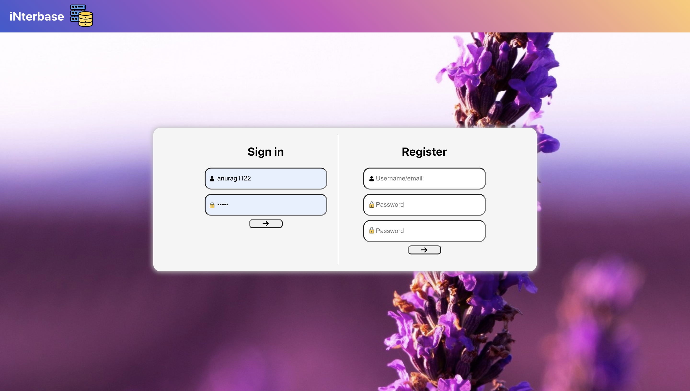
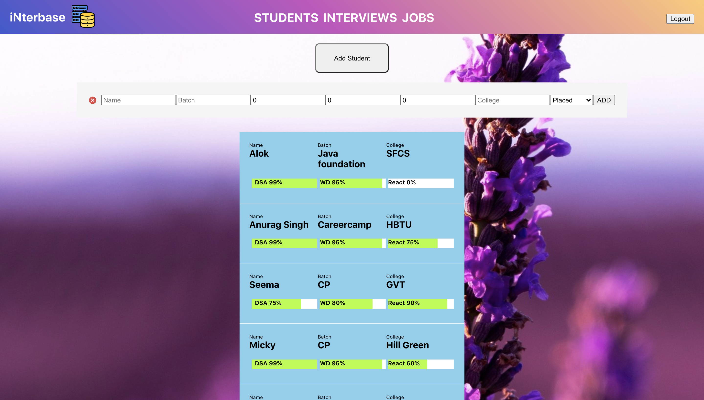
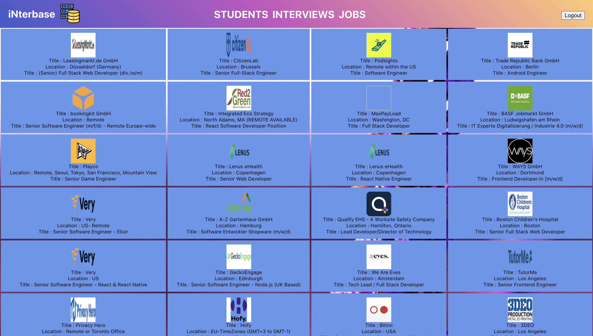

## What's the app?
This is basically a Interview Management System that stores information of students and assigns them to available interviews.
Backend : Node.js
Frontend : React

## How to install on my PC?
1) Clone the master branch of this git repo
2) Navigate to folder and run `npm install`
3) After node packages have been installed, run `npm run dev`
4) Browser will automatically open and the app will render

## Features?
1) Beautifully detailed Student card that contains the scores in various domains and student details
2) Ability to add new interviews and students
3) Dynamic with no refreshes, fluid UI
4) Job portal showing jobs in React

## Screenshots

## Folder structure
/Client : react root
/Client/src : react component
server.js : entry point of node.js background
/routes : contains various routing files for /students /interviews /company
/models : contains various models of mongodb
/controllers : contains various controllers like student , company , interview , authentication
